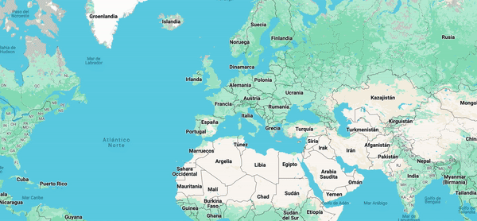

# Hello, i'm Mar Aguayo 🌊

Based in Barcelona, Spain.

## **Currently**
Full Stack developer student on <a href="https://4geeksacademy.com/us/index"> 4 Geeks Academy </a>

  

## **My other passions**

- Videographer, social media and accout manager for the last 8 years.
- Love to travel the globe and learn from everything I can.

<!--
**magufl/magufl** is a ✨ _special_ ✨ repository because its `README.md` (this file) appears on your GitHub profile.

Here are some ideas to get you started:

- 🔭 I’m currently working on ...
- 🌱 I’m currently learning ...
- 👯 I’m looking to collaborate on ...
- 🤔 I’m looking for help with ...
- 💬 Ask me about ...
- 📫 How to reach me: ...
- 😄 Pronouns: ...
- ⚡ Fun fact: ...
-->
